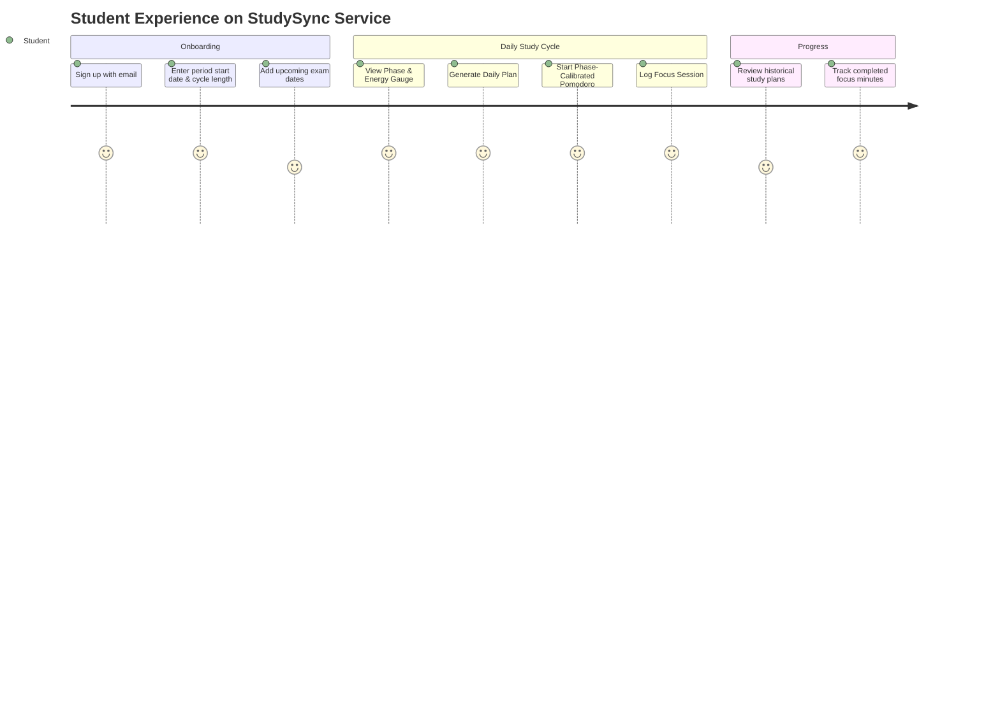

# StudySync 🎓🌸

> **Menstrual-cycle-aware study optimization platform for female students.**  
> StudySync is a privacy-first web platform that adapts daily study workloads, active recall strategies, and Pomodoro timers to natural monthly cognitive energy rhythms.

[](#-testing--quality-assurance)
[](https://www.typescriptlang.org/)
[](https://nextjs.org/)
[](#-license--confidentiality)

---

## 🌐 Hosted Service

- **Production URL**: [https://studysync.vercel.app](https://studysync.vercel.app) *(or your custom production domain)*
- **Target Audience**: High school, undergraduate, and graduate students preparing for competitive and semester exams.
- **Service Model**: Zero-cost, privacy-first SaaS platform.

---

# PART 1: PRODUCT & PLATFORM OVERVIEW

## 💡 What StudySync Solves
Traditional study schedules treat all days identically—demanding constant high-intensity output regardless of physiological reality. During certain cycle phases (like late luteal or menstruation), forcing rigid 60-minute deep-focus blocks often causes brain fog, guilt, and burnout.

StudySync is **NOT** a period tracker. It is an **academic optimizer** that:
1. **Calibrates Focus Blocks**: Automatically shortens or lengthens Pomodoro sessions (e.g., 20m light review during Menstruation vs. 50m deep focus during Follicular).
2. **Prioritizes Urgent Exams**: Re-weights task urgency and academic milestones dynamically.
3. **Recommends Phase-Specific Study Techniques**: Suggests synthesis and new conceptual learning when neuroplasticity peaks, and checklist problem sets or active recall when detail-orientation is highest.

---

## 🧠 The Science: Cognitive Cycle Optimization

The platform dynamically scales the cycle into four distinct cognitive windows (supporting cycles from 21 to 45 days):

```
       Menstruation            Follicular             Ovulation              Luteal
     (Days 1 - ~5)           (Days ~6 - ~14)       (Days ~15 - ~16)      (Days ~17 - ~28)
  ┌──────────────────┐    ┌──────────────────┐   ┌──────────────────┐   ┌──────────────────┐
  │  Reflective /    │ ─► │  Curiosity /     │ ─►│  High Energy /   │ ─►│ Detail-Oriented /│
  │  Low Energy      │    │  High Neuroplastic│  │  Verbal Fluency  │   │ Focus on Review  │
  └──────────────────┘    └──────────────────┘   └──────────────────┘   └──────────────────┘
    20m focus / 5m rest    50m focus / 10m rest   50m focus / 10m rest   25m focus / 5m rest
```

| Phase | Energy & Cognitive Profile | Focus / Break | Recommended Academic Methods |
|---|---|---|---|
| **Menstruation** | Lower stamina, higher reflective intuition | **20 min** / 5 min | Concept mapping, summary reviews, light flashcard drills |
| **Follicular** | Peak learning ability, high curiosity & openness | **50 min** / 10 min | Deep dives into difficult new concepts, complex synthesis, problem-solving |
| **Ovulation** | Peak confidence, high verbal communication | **50 min** / 10 min | Feynman technique, practice presentations, study groups, mock exams |
| **Luteal** | Decreased focus endurance, high detail-orientation | **25 min** / 5 min | Practice test sets, error analysis, formatting notes, proofreading |

---

## 🔄 End-to-End User Experience & Flow



---

## 🛡️ Privacy & Compliance Guarantees

As a hosted service, student privacy is a primary design requirement:
- **Zero Symptom Tracking**: No logging of physical symptoms, flow intensity, fertility, body temperature, or intimate details.
- **Minimal Surface**: Requires only two numbers: date of last period start and average cycle length.
- **Tenant Isolation**: All database operations are sandboxed via PostgreSQL Row Level Security (RLS). No user can access or view another student's data.

---

# PART 2: INTERNAL DEVELOPER & CONTRIBUTOR GUIDE

This section is for engineers, designers, and contributors working on the StudySync platform.

## 🛠️ Tech Stack & Architecture

```
[ Web Browser ]
      │
      ▼
[ Next.js 14 App Router ] ── (Server Actions / "use server")
      │
      ├── Auth & Route Protection ──► Supabase Auth + Middleware Session Refresh
      ├── Core Cycle Engine       ──► Pure TS (Deterministic Proportional Boundary Math)
      ├── Plan Generation         ──► Rule-Based Optimizer + (Optional) OpenRouter Fallback
      └── Database / Persistence  ──► Supabase PostgreSQL (Strict RLS Policies)
```

- **Frontend**: Next.js 14 (App Router), React 18, Tailwind CSS, shadcn/ui, Lucide Icons.
- **Backend**: Next.js Server Actions, Node.js runtime.
- **Persistence & Auth**: Supabase PostgreSQL with Row Level Security.
- **Testing**: Node.js Test Runner with `tsx`.

---

## 💻 Local Development Setup

Follow these steps to spin up a local development instance of the service:

### 1. Clone & Install
```bash
git clone https://github.com/pandeyayushk/StudySync.git
cd StudySync
npm install
```

### 2. Environment Configuration
Create a `.env.local` file in the project root:
```env
NEXT_PUBLIC_SUPABASE_URL=https://your-project.supabase.co
NEXT_PUBLIC_SUPABASE_ANON_KEY=your-supabase-anon-key
NEXT_PUBLIC_APP_URL=http://localhost:3000

# Optional: OpenRouter API key for LLM plan generation (falls back to rule engine if omitted)
OPENROUTER_API_KEY=
```

### 3. Database Migration & Seed Data
1. In your development Supabase project, navigate to the **SQL Editor**.
2. Run `supabase/schema.sql` (creates tables, foreign keys, triggers, and RLS policies).
3. *(Optional)* Run `supabase/seed.sql` to populate sample users, exams, and test study plans.

### 4. Start Development Server
```bash
npm run dev
```
Access the application at [http://localhost:3000](http://localhost:3000).

---

## 📂 Repository Structure

```text
src/
├── actions/              # Server Actions (Backend RPC layer)
│   ├── auth.ts           # Sign in, Sign up, Sign out
│   ├── cycle.ts          # Get / Save cycle parameters
│   ├── exams.ts          # CRUD for student exams
│   ├── plans.ts          # Study plan generation and storage
│   ├── profile.ts        # User profile management
│   └── timer.ts          # Pomodoro session logging and stats
├── app/                  # Next.js App Router (Pages, Layouts, API routes)
│   ├── (auth)/           # /sign-in, /sign-up, /callback
│   ├── dashboard/        # Authenticated student workspace
│   │   ├── plans/        # Historical study plans
│   │   ├── settings/     # Profile and preferences
│   │   ├── setup/        # Onboarding & cycle configuration
│   │   └── page.tsx      # Core dashboard (Phase card, Pomodoro, Exam list)
│   └── page.tsx          # Public landing page
├── components/           # Reusable UI layer
│   ├── dashboard/        # Dashboard widgets (PomodoroTimer, PhaseIndicator, etc.)
│   ├── forms/            # Form components with Zod validation
│   ├── landing/          # Hero, Feature grid, Testimonials, Footer
│   └── ui/               # shadcn/ui primitives (Button, Card, Dialog, etc.)
├── lib/                  # Core domain logic
│   ├── cycle/            # Cycle math, phase boundary scaling & tips
│   ├── study/            # Rule-based generator & OpenRouter AI fallback
│   └── supabase/         # Browser/Server Supabase clients and middleware
├── types/                # Shared TypeScript models and DTOs
└── validations/          # Zod validation schemas
```

---

## 🔌 Internal API & Server Actions Reference

StudySync uses Next.js 14 Server Actions with strict Zod validation and authenticated Supabase client sessions.

### 1. Cycle Actions (`src/actions/cycle.ts`)
- **`saveCycleSettings(data)`**
  - **Input**: `{ lastPeriodDate: string (YYYY-MM-DD), averageCycleLength: number (21-45) }`
  - **Output**: `{ success: true, data: CycleSettings }` or `{ error: string }`
- **`getCycleSettings()`**
  - **Output**: `CycleSettings | null`

### 2. Exam Management (`src/actions/exams.ts`)
- **`getExams()`**
  - **Output**: `Exam[]` (Filtered to future exams, sorted by `exam_date ASC`)
- **`addExam(data)`**
  - **Input**: `{ subject: string, examDate: string, priority: 'low' | 'medium' | 'high', notes?: string }`
  - **Output**: `{ success: true, data: Exam }`
- **`deleteExam(examId)`**
  - **Input**: `string` (UUID)
  - **Output**: `{ success: true }`

### 3. Study Plan Generator (`src/actions/plans.ts`)
- **`generateAndSavePlan()`**
  - Evaluates user's current cycle phase and upcoming exams.
  - Generates optimized daily tasks via AI (or rule-based fallback).
  - Upserts to `study_plans` table (`UNIQUE(user_id, plan_date)`).
  - **Output**:
    ```json
    {
      "id": "uuid",
      "planDate": "2026-09-04",
      "cyclePhase": "follicular",
      "cycleDay": 9,
      "focusDuration": 50,
      "breakDuration": 10,
      "studyMethod": "Active Recall & Problem-based learning",
      "motivationNote": "Your brain is primed for learning! Tackle that hard subject with confidence.",
      "tasks": [
        {
          "subject": "Organic Chemistry",
          "task": "Deep dive into reaction mechanisms",
          "priority": "high",
          "estimatedMinutes": 50
        }
      ]
    }
    ```
- **`getPlans()`**: Fetches saved daily plans ordered by date descending.
- **`deletePlan(planId)`**: Deletes a specific saved plan.

### 4. Timer Sessions (`src/actions/timer.ts`)
- **`logTimerSession(payload)`**
  - Automatically triggered when Pomodoro timer completes a focus interval.
  - **Input**: `{ durationMinutes: number, breakMinutes: number, completed: boolean, cyclePhase: string }`
  - **Output**: `{ success: true, session: TimerSession }`
- **`getTimerStats()`**
  - **Output**: `{ totalSessions: number, totalFocusMinutes: number }` (for today)

---

## 🧪 Testing & Quality Assurance

All core domain logic and validation schemas are backed by unit tests:

```bash
# Run unit tests
npm test
```

Expected output:
```text
✔ Cycle Engine - calculateCycleDay
✔ Cycle Engine - getCyclePhase with standard 28-day cycle
✔ Cycle Engine - getCyclePhase with custom cycle length (35 days)
✔ Cycle Engine - getPhaseInfo returns valid durations and tips
✔ Cycle Engine - getDaysUntilNextPhase and getPhaseProgress
✔ Plan Generator - creates structured plan without exams
✔ Plan Generator - prioritizes urgent exams
✔ Validations - cycleSettingsSchema accepts valid date and cycle length
✔ Validations - examSchema validates subjects and future dates
✔ Validations - profileSchema validates non-empty full name

ℹ tests 10 | pass 10 | fail 0
```

### Type Checking & Production Build Check
```bash
npm run build
```

---

## 🚀 Service Deployment & Infrastructure

### Production Hosting Architecture
- **Web Frontend & API**: Vercel (Edge Network + Serverless Functions)
- **Database**: Supabase Managed PostgreSQL (AWS / Frankfurt or desired region)
- **Session Auth**: HTTP-Only Cookie with PKCE flow via `@supabase/ssr`

### Production Environment Variables
| Variable | Description | Exposed to Client? |
|---|---|---|
| `NEXT_PUBLIC_SUPABASE_URL` | Supabase API Gateway URL | Yes |
| `NEXT_PUBLIC_SUPABASE_ANON_KEY` | Supabase Anonymous Client Key (RLS enforced) | Yes |
| `NEXT_PUBLIC_APP_URL` | Canonical Production Domain (e.g., `https://studysync.vercel.app`) | Yes |
| `OPENROUTER_API_KEY` | Optional: AI Plan Generator API Key | No (Server only) |

---

## 📄 License & Confidentiality

Copyright © 2026 StudySync Team. All rights reserved.  
This software and documentation are proprietary and confidential.
